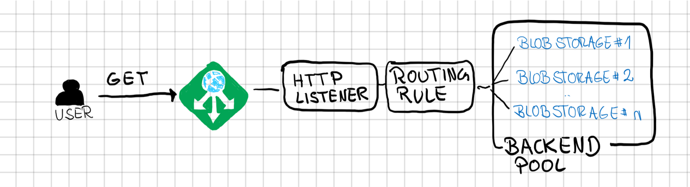

# az-storagesharding
How to shared over multiple azure storage accounts.

## Azure Storage Limits:
Azure Storage Account have limits on Bandwidth and IOPS:

|Resource|Limit|Type|
|---|----|---|
|Number of storage accounts per region per subscription, including standard, and premium storage accounts.|250|-|
|Maximum storage account capacity|5 PiB|soft|
|Maximum number of blob containers, blobs, file shares, tables, queues, entities, or messages per storage account|No limit|-|
|Maximum request rate per storage account|20,000 requests per second|soft|
|Maximum ingress per storage account (US, Europe regions)|10 Gbps|-|
|Maximum ingress per storage account (regions other than US and Europe)|5 Gbps if RA-GRS/GRS is enabled, 10 Gbps for LRS/ZRS2|-|
|Maximum egress for general-purpose v2 and Blob storage accounts (all regions)|50 Gbps|-|
|Maximum number of virtual network rules per storage account|200|-|
|Maximum number of IP address rules per storage account|200|-|
|Target request rate for a single blob|Up to 500 requests per second|hard|
|Target throughput for a single page blob|Up to 60 MiB per second|-|
|Target throughput for a single block blob|Up to storage account ingress/egress limits|-|

Source:
- [Storage limits](https://docs.microsoft.com/en-us/azure/azure-resource-manager/management/azure-subscription-service-limits#storage-limits)
- [Azure Blob storage limits](https://docs.microsoft.com/en-us/azure/azure-resource-manager/management/azure-subscription-service-limits#azure-blob-storage-limits)

Storage limits:
When certain metrics like Maximum request rate per storage account is exceeded the following throttling behaviour takes place;

|Error code|HTTP status code|User message|
|--|--|--|
|ServerBusy|Service Unavailable (503)|The server is currently unable to receive requests. Please retry your request.|
|ServerBusy|Service Unavailable (503)|Ingress is over the account limit.|
|ServerBusy|Service Unavailable (503)|Egress is over the account limit.|
|ServerBusy|Service Unavailable (503)|Operations per second is over the account limit.|

source: [Storage Rest API Error Codes](https://docs.microsoft.com/en-us/rest/api/storageservices/common-rest-api-error-codes)

### Summary

- We can serve 500 req/sec in paralle for a single Blob.
- We can serve 20000 req/sec via a single Storage Account.
- We can serve a max of 60 Mbps for a single Blob Storage.
- We can serve 10000 Mbps via a single Storage Account.

## Serve a single blob with +500 req/sec

In case we like to serve a single blob with +500 req/sec we will need to use multiple storage accounts.

To loadbalance between the Storage Accounts we are going to use Application Gateway:

## Create an SSL Certificate

In case you like to serve the content via HTTPS you will need to create an Server Ceriticate (pfx) and provide it base64 encoded inside the ARM template.

~~~~bash
chpinoto@cpt-surfacebook1:/mnt/c/Users/chpinoto/workspace/az-storagesharding/ignore$ cat <DOMAIN>.pfx | base64 > <DOMAIN>.pfx.base64.txt
~~~~

## Deploy ARM Template

The ARM Template [./arm/deploy.json](./arm/deploy.json) will deploy the corresponding Setup:

~~~~pwsh
PS C:\sbapp> az deployment group create --resource-group <RESOURCE-GROUP-NAME> --mode Incremental --name create --template-file ./arm/deploy.json -p @ignore/deploy.parameters.json
~~~~

### China Deployment

We also generated a ARM Template ([./arm/deploy.china.json](./arm/deploy.china.json)) for the Azure China Region. The following points need to be considered in case of China:

- Application Gateway V2 is only supported in certain China Regions (we used "China North 2").
- Availability Zones for Application Gateway are not supported.
- Availability Zones for Public IP are not supported.
- Routing Preference for Storage Account are not supported.
- Make sure to choose the right Storage Domain for China ("blob.core.chinacloudapi.cn").

### DNS Entry

In case you like to test via your Domain directly you will need to add an A Record inside the corresponding DNS Zone and use the Application Gateway Public IP.

### Number of Storage Accounts

The ARM Template will deploy two Storage Account.
The Application Gateway will load balance incoming request between both Storage Account.
To make this work we will need to store the same Data under the same Container on both Storage Accounts.
This will double our Storage cost but I believe this is still cheaper compared to setup some Rewrite Rules on the Application Gateway.

### Azure Storage Access

Azure Storage Account are setup to only allow the Application Gateway and myIP to access the corresponding Data directly via the following Azure Storage Account setup:

~~~~json
"networkAcls": {
    "resourceAccessRules": [],
    "bypass": "AzureServices",
    "virtualNetworkRules": [
        {
            "id": "[variables('subnetRef')]",
            "action": "Allow",
            "state": "Succeeded"
        }
    ],
    "ipRules": [
        {
            "value": "[parameters('myip')]",
            "action": "Allow"
        }
    ],
    "defaultAction": "Deny"
},
~~~~

### Azure Storage Internet Routing

We did setup Azure Storage Account with [Internet Routing Preference](https://docs.microsoft.com/en-us/azure/storage/common/network-routing-preference). This will reduce the Bandwidth cost.

~~~~json
"routingPreference": {
    "routingChoice": "InternetRouting",
    "publishMicrosoftEndpoints": false,
    "publishInternetEndpoints": false
},
~~~~

### Cooled Blobs

We did setup the Azure Blob Storage with Access Tier "Cool".
Our expection is that we will only use "read" operations and therefore "Cool" is the most cost efficient option.

~~~~json
    },
    "accessTier": "Cool"
}
~~~~

## Test URL

Access the file directly via the blob storage

~~~~bash
curl -v -k curl -v -k https://<STORAGE-ACCOUNT-NAME>.blob.core.windows.net/test/test.txt
~~~~

Access via the Application Gateway

~~~~bash
curl -v -k curl -v -k https://<YOUR-DOMAIN>/test
~~~~

Clean Up

~~~~pwsh
PS C:\sbapp> az deployment group create --resource-group ru2-rg --mode complete --name delete-ru2 --template-file ./arm/empty.json
~~~~

## Usefull Links
- [Use Azure Storage blob inventory to manage blob data](https://docs.microsoft.com/en-us/azure/storage/blobs/blob-inventory)
 - The Azure Storage blob inventory feature provides an overview of your blob data within a storage account. Use the inventory report to understand your total data size, age, encryption status, and so on. The report provides an overview of your data for business and compliance requirements. Once enabled, an inventory report is automatically created daily.

